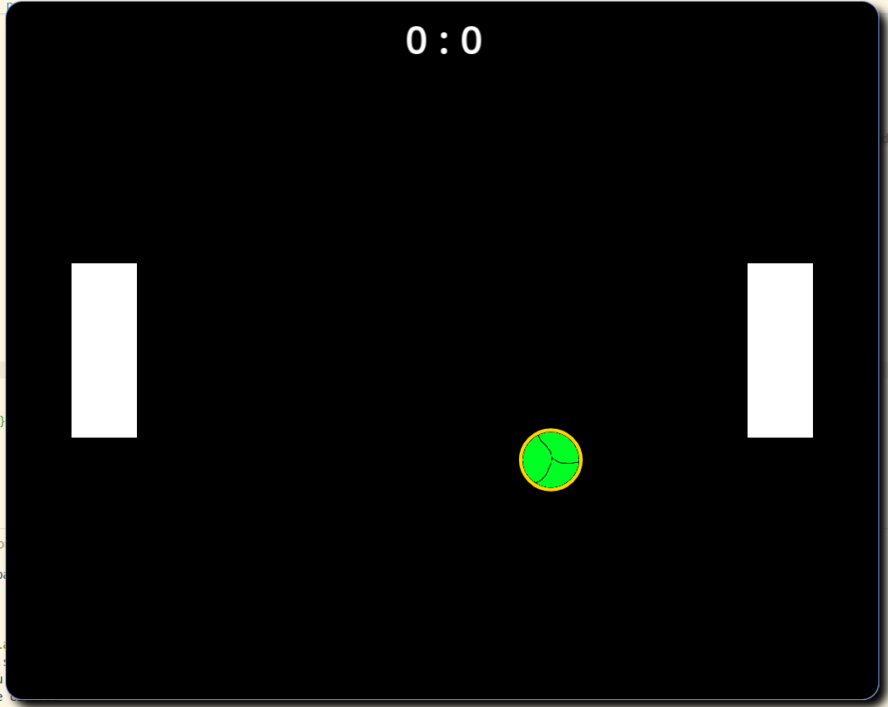

# Instruction

A collection of small programms to learn SFML and starting to explore graphical programming. You can explore all via a terminal interface. Just enter the number of the wanted programm.

1. How to Install
2. Overview
3. Misc

# How to Install

## Prerequisites

Make sure you have **SFML 2.5** and **CMake** installed.

## Installation

1. **Clone the repo**

```bash
git clone https://github.com/TrainFan1804/FunWithSFML.git
cd FunWithSFML
```

2. **Create build directory inside and move inside**

```bash
mkdir -p build
cd build
```

3. **Configure and build project with cmake**

```bash
cmake ..
cmake --build .
```

4. **Run the application**

```bash
./src/FunWithSFML
```

5. **Have fun!**

# Overview

## Hello World Triangle


## Some little fun with squares and vector transformations


## Working with keyboard inputs


## A small pong game

Here I tried to create a small game of pong.



# Misc

The used font in pong isn't inculded in this project!